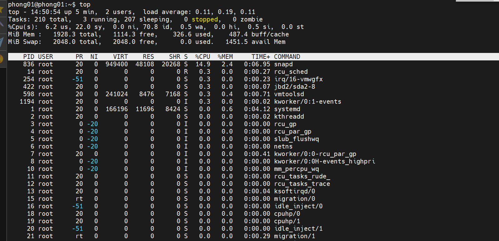

# ***Lệnh `top`***
Lệnh "top" là một công cụ dòng lệnh được sử dụng để hiển thị thông tin về tài nguyên hệ thống và quá trình đang chạy trên hệ thống. Khi chạy lệnh "top", bạn sẽ thấy một giao diện tương tự bảng điều khiển, hiển thị các thông số cơ bản như tải CPU, sử dụng bộ nhớ, quá trình đang chạy và nhiều thông tin khác.

## ***Các thông số quan trọng mà `top` hiển thị bao gồm:***

- %CPU: Phần trăm sử dụng CPU của mỗi quá trình.
- %MEM: Phần trăm sử dụng bộ nhớ của mỗi quá trình.
- VIRT: Tổng lượng bộ nhớ ảo sử dụng bởi quá trình.
- RES: Lượng bộ nhớ thực tế đang sử dụng bởi quá trình.
- SHR: Lượng bộ nhớ được chia sẻ bởi quá trình.
- PID: ID của quá trình.
- USER: Người dùng sở hữu quá trình.
- COMMAND: Tên của quá trình.

## ***Các option lệnh `top`***
-`d <delay>`: Thiết lập thời gian chờ giữa các lần làm mới của giao diện top. Mặc định là 3 giây.
ví dụ: ```top -d 5```

-n <iterations>: Đặt số lần làm mới giao diện top trước khi thoát.
ví dụ: ```top -n 10```
-p <pid(s)>: Hiển thị thông tin chỉ về các quá trình có các PID được chỉ định, thay vì hiển thị tất cả các quá trình.
ví dụ: ```top -p 1234,5678```

-c: Hiển thị tên đầy đủ của các tiến trình thay vì chỉ hiển thị tên ngắn gọn.
ví dụ: ```top -c```

-u <username>: Chỉ hiển thị các quá trình thuộc về người dùng cụ thể.
ví dụ: ```top -u phong01```


